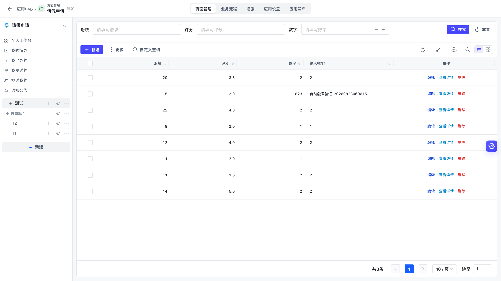
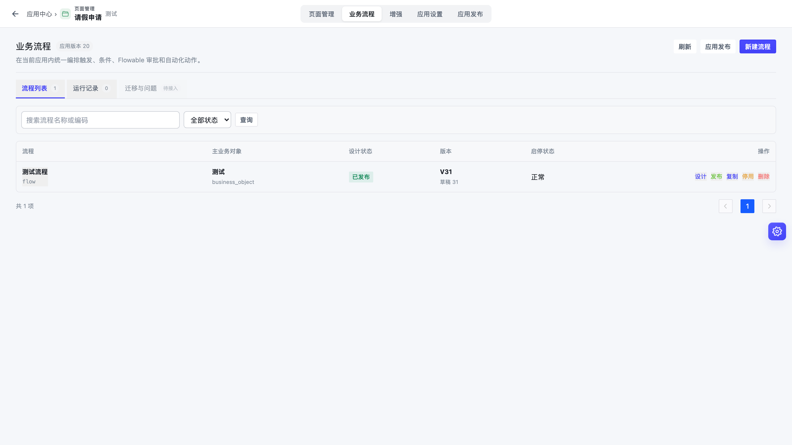
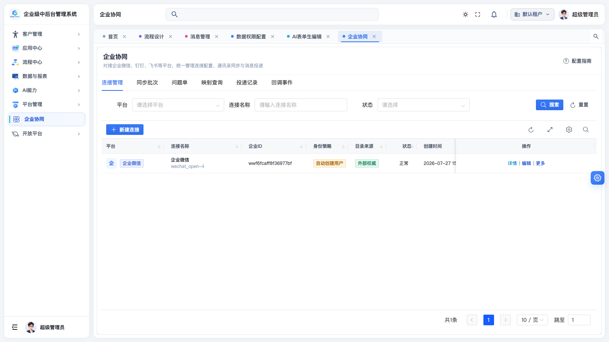
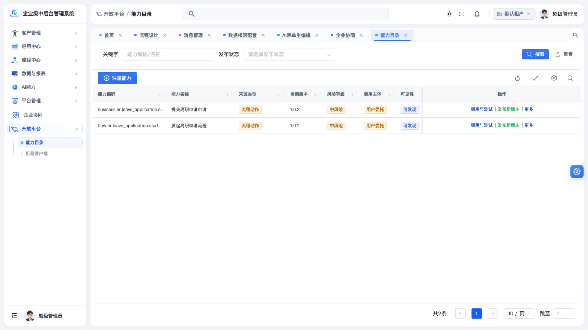

# 低代码、流程、企业协同、能力开放：一个中后台框架能帮企业省下什么？

> Forge Admin 最近完成了一轮大版本更新：低代码应用平台重构为「页面优先」的新架构，业务流程升级为画布编排，企业协同接通企微全能力，能力开放平台走向产品化。这篇博文不聊技术细节，只聊一件事——这四块能力拼在一起，能帮企业真正做成哪些有价值的事。

## 先说结论：四块能力，解决企业数字化的四个老问题

做过企业信息化的人都熟悉这四个场景：

1. **业务部门排队等 IT**——一个「供应商登记」这样的小系统，排期两个月，上线时需求已经变了；
2. **系统建好了没人用**——员工要记新网址、新账号、新操作，最后审批还是靠微信群里喊；
3. **流程靠人肉驱动**——合同到期提醒、客户跟进通知，全靠经办人记性，漏一次就是一次事故；
4. **对外对接全靠定制开发**——经销商要下申请单、外部系统要取数据，每个对接方写一套接口，安全审计全靠自觉。

Forge Admin 这轮更新，就是对着这四个问题去的：

| 企业的问题 | Forge Admin 的能力 | 带来的改变 |
|------------|--------------------|------------|
| 小系统排期长、交付慢 | 低代码应用平台 | 业务人员参与搭建，天级交付长尾系统 |
| 流程靠人记、靠人催 | 业务流程画布 | 事件/定时自动触发，规则配置即生效 |
| 系统没人用、推广难 | 企业协同 | 员工在企微里登录、收消息、办审批，零学习成本 |
| 对外对接反复定制 | 能力开放平台 | 能力上架目录、受控发布、网关统一鉴权审计 |

下面逐个展开。

---

## 一、低代码：让「长尾系统」不再排队等排期

企业里真正耗死 IT 团队的，往往不是核心系统，而是几十上百个「小而急」的长尾需求：预售登记、设备巡检、物料申领、活动报名……每个都不复杂，但每个都要建表、写 CRUD、做权限、部署上线。

重构后的低代码平台把这件事压缩成三步：

1. **创建应用**：空白创建、从模板创建、从 Excel 创建、AI 智能创建，四种方式任选；
2. **新建页面**：表单页、列表页、列表+表单、自定义页面四种形态，把字段组件拖上画布，**系统自动在业务对象上创建字段、自动建数据库列**——业务人员不需要知道什么是「建表」；
3. **发布上线**：协调发布生成版本快照，应用立刻通过独立门户 `/app/{应用编码}` 访问，PC 和移动端 H5 同一套配置。

更关键的是**不锁死**：低代码搭出来的应用可以一键导出真实源码（Java + Vue），复杂业务随时切回手工开发继续演进。低代码是加速器，不是牢笼。

**对企业意味着什么**：核心系统继续精雕细琢，长尾系统交给业务骨干自己搭。IT 从「接需求的」变成「定规范的」，交付周期从月级变成天级。

---

## 二、业务流程画布：把「人肉驱动」变成「规则驱动」

低代码解决了「系统建得快」，流程画布解决的是「业务自己跑」。

这轮更新把过去分散的触发器、流程绑定、业务动作三套配置，合并成一张统一的自动化画布，提供三种开始方式：

- **手动开始**：员工在门户里点「发起」；
- **事件触发**：新建客户后自动发欢迎通知、订单变更后自动同步下游；
- **定时触发**：合同到期前 30 天自动提醒、每周一自动生成周报待办。

画布上可以自由编排条件分支、执行动作、审批流程（对接 Flowable）和子流程调用。过去需要写代码、改配置、重新上线的自动化规则，现在业务人员在画布上连线即可，发布即生效。

**对企业意味着什么**：把「靠经办人记性」的流程，变成「系统到点自己跑」。漏提醒、漏跟进这类事故，从管理问题降级为配置问题。

---

## 三、企业协同：系统走向员工，而不是员工走向系统

再好的系统，员工不打开就是零。企业里员工每天停留的地方只有一个——企业微信（或飞书、钉钉）。

Forge Admin 的企业协同以企业微信为首个完整适配器，一次配置接通五种能力：

| 能力 | 效果 |
|------|------|
| 通讯录同步 | 企微部门/成员/标签自动同步为组织与用户，离职转岗自动校准 |
| 扫码登录 | 企微扫码直接进系统，身份由服务端校验，失败关闭 |
| 消息投递 | 系统通知、审批提醒以企微应用消息送达，逐人记录投递结果 |
| 待办投影 | 流程待办变成企微待办卡片，在企微里直接同意/驳回 |
| 回调事件 | 企微侧变更安全回传，验签、去重、幂等全套防护 |

底层是平台无关的 Provider/Connector SPI：飞书、钉钉后续接入只需实现对应 Connector 并通过合同测试，组织同步、消息、待办的主链路一行不改。

**对企业意味着什么**：员工不装新 App、不记新账号，在企微里就能办审批、收提醒。系统推广成本从「全员培训」降到「发个通知」。

---

## 四、能力开放：把内部系统变成「能力供应商」

企业发展到一定阶段，必然要对外开口：经销商要在线提交申请、外部系统要发起流程、合作伙伴要查询状态。传统做法是每个对接方定制一套接口，时间一长，接口散落、权限失控、审计缺失。

能力开放平台把这件事产品化了：

- **能力目录**：低代码业务动作、流程动作、受控系统服务统一上架，目录化展示；
- **受控发布**：能力以不可变版本快照发布，入参出参 Schema 固定，调用方拿到的文档（Markdown + OpenAPI 3.1）与运行时行为严格一致；
- **开放网关**：OAuth / HMAC 双认证，限流、幂等、审计内置，外部系统一次调用即可完成「创建业务记录 + 发起主流程」；
- **调用指南与在线测试**：管理员选好客户端，直接看到可调用状态、阻断原因和可复制的请求示例，在线实测通过再交付给对接方。

**对企业意味着什么**：对外对接从「每次定制开发」变成「上架、授权、交付文档」的标准化流程。安全边界由网关统一守住，每一次外部调用都有审计可查。

---

## 五、拼在一起：一个完整闭环

单独看，每块能力都不新鲜；拼在一起，才是这套框架真正的价值。用一个真实场景串起来：

> 某企业要给经销商做「预售登记」系统。
>
> 1. 业务骨干用**低代码**一天搭好登记表单和审批页面，发布到独立门户；
> 2. 在**流程画布**上配置：登记提交后自动发起审批，审批通过自动发消息，7 天未跟进自动提醒；
> 3. 通过**企业协同**，审批人在企微待办里直接处理，经销商登记成功立刻收到企微通知；
> 4. 通过**能力开放**，把「提交预售登记」发布为标准能力，经销商自己的系统一次调用即可完成登记+发起流程，调用记录全程审计。

同一个业务，传统模式下是：需求评审、建表、写代码、联调、培训、定制对接——按月计。在 Forge Admin 里，四块能力各管一段，按天计，且每一段都有统一的安全与审计兜底。

| 维度 | 传统自研 | Forge Admin |
|------|----------|-------------|
| 长尾系统交付 | 月级排期 | 天级搭建 |
| 流程自动化 | 写代码上线 | 画布配置即生效 |
| 员工触达 | 推新系统、做培训 | 企微内直接使用 |
| 对外对接 | 逐家定制接口 | 目录上架 + 标准网关 |
| 安全与审计 | 各系统各自为战 | 凭据加密、网关审计统一兜底 |
| 退出成本 | — | 代码可导出，不被平台锁死 |

---

## 试一试

所有能力都可以在在线演示环境里直接体验：

| 入口 | 地址 |
|------|------|
| 后台管理 | http://www.dlforgelab.com:8084/forge/login |
| 移动端 H5 | http://www.dlforgelab.com:8084/forge-h5/ |
| 项目文档 | http://www.dlforgelab.com:8084/forge-docs/ |
| AI 数据大屏 | http://www.dlforgelab.com:8084/forge-report/ |

体验账号：`admin / 123456`（H5：`h5_admin / 123456`）

源码与社区：

- **Gitee**：https://gitee.com/ForgeLab/forge-admin
- **GitHub**：https://github.com/yaomindong1996/forge-admin

Forge Admin 基于 Apache 2.0 开源，Vue 3 + Spring Boot 3，微内核插件化架构。如果你也在为企业的长尾系统、流程自动化、移动办公和对外集成头疼，欢迎来演示环境点一点，或者到仓库里提 Issue 聊聊你的场景。
