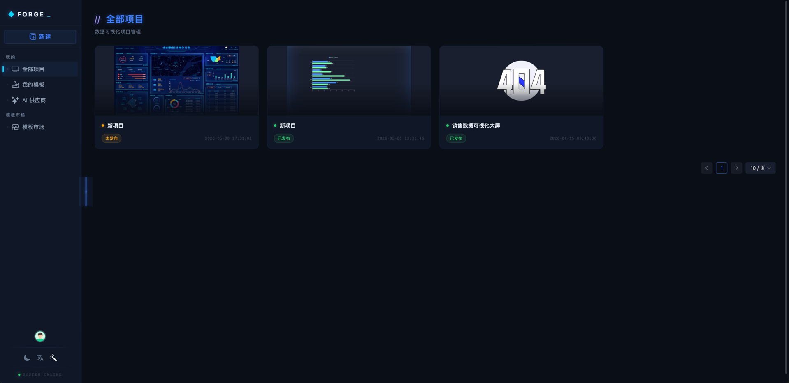
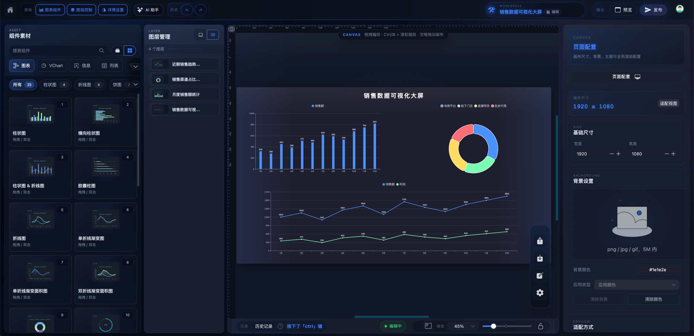
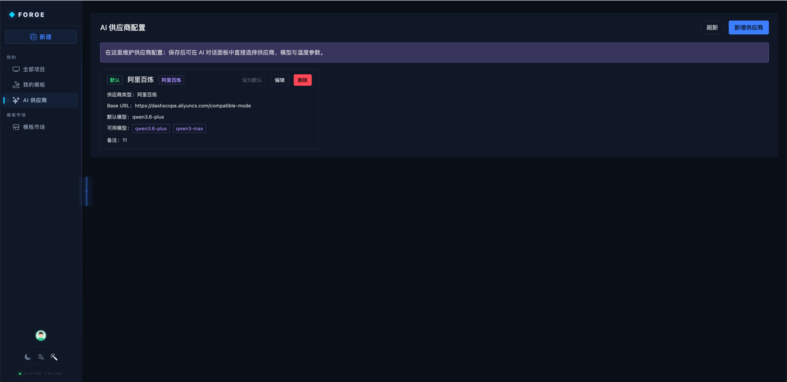

<p align="center">
  
</p>

<h1 align="center">Forge AI</h1>

<h4 align="center">
  AI 驱动的数据可视化低代码开发平台
</h4>

<p align="center">
  
  
  
  
  
  
</p>

---

## ✨ 核心特性

<table>
  <tr>
    <td width="33%"><strong>🤖 AI 智能生成</strong></td>
    <td width="33%"><strong>🧩 组件素材库</strong></td>
    <td width="33%"><strong>🎨 主题定制</strong></td>
  </tr>
  <tr>
    <td>接入 AI 大模型，一句话描述即可自动生成数据大屏页面。支持多供应商灵活配置，AI 对话式交互完成组件编排与数据配置。</td>
    <td>内置 50+ 图表组件，涵盖柱状图、折线图、饼图、雷达图、热力图、地图等。所有组件支持拖拽编排、自由缩放与图层管理。</td>
    <td>内置多套深/亮色主题，支持自定义主题色、全局滤镜、背景图片/颜色、画布尺寸与适配方式。</td>
  </tr>
  <tr>
    <td><strong>📊 数据接入</strong></td>
    <td><strong>⚡ 事件交互</strong></td>
    <td><strong>🚀 一键发布</strong></td>
  </tr>
  <tr>
    <td>支持静态数据、动态 HTTP 请求、数据池三种数据模式。内置数据映射、过滤器、在线编辑器，轻松对接后端 API。</td>
    <td>支持组件交互事件（单击/双击/鼠标进入/移出）、高级生命周期事件（渲染前/后）、自定义 JavaScript 代码编辑器。</td>
    <td>编辑完成即可发布上线，自动生成预览链接，支持截图分享。发布前自动保存，杜绝数据丢失。</td>
  </tr>
</table>

---

## 📸 界面预览

| 页面 | 截图 |
|------|------|
| **登录页** |  |
| **项目列表** |  |
| **画布编辑器** |  |
| **AI 供应商配置** |  |

<details>
<summary>更多截图</summary>

**画布编辑**


**登录页**


**项目列表**


</details>

---

## 🛠 技术栈

| 类别 | 技术 | 版本 |
|------|------|------|
| 框架 | Vue 3 | 3.5.x |
| 构建 | Vite | 7.x |
| 语言 | TypeScript | 5.x |
| UI 组件库 | Naive UI | 2.42.x |
| 状态管理 | Pinia | 3.x |
| 样式引擎 | UnoCSS | 66.x |
| 图表库 | ECharts / VChart | 6.x / 1.x |
| 代码编辑器 | Monaco Editor | - |
| 流程设计器 | BPMN.js | 17.x |
| HTTP | Axios | 1.11.x |

---

## 🚀 快速开始

### 环境要求

- **Node.js** >= 18.20
- **pnpm** >= 8

### 安装与运行

```bash
# 克隆项目
git clone <repo-url>
cd forge-report-ui

# 安装依赖
pnpm install

# 启动开发服务器 (默认 localhost:5173)
pnpm dev

# 生产构建
pnpm build

# Lint 检查
pnpm lint:fix
```

### 环境变量

```bash
# 复制环境变量模板
cp .env.example .env.local

# 编辑 .env.local 配置后端 API 地址
```

> 默认登录凭证：`admin` / `123456`

---

## 📦 项目结构

```
forge-report-ui/
├── src/
│   ├── api/              # API 接口定义
│   ├── components/       # 公共组件（AI 面板、文件上传、表单设计器等）
│   ├── composables/      # 组合式 API（useDict、usePermission 等）
│   ├── layouts/          # 布局组件
│   ├── router/           # 路由配置（动态路由 + 权限过滤）
│   ├── stores/           # Pinia Store（画布、图层、历史、AI 等）
│   ├── utils/            # 工具函数（请求、加解密、文件处理）
│   ├── views/            # 页面视图
│   │   ├── chart/        # 可视化工作台（核心编辑器）
│   │   ├── edit/         # JSON 源码编辑器
│   │   ├── login/        # 登录页
│   │   ├── preview/      # 预览页
│   │   └── project/      # 项目管理
│   ├── packages/         # 图表组件注册与配置
│   ├── plugins/          # 插件（图标、NaiveUI 注册）
│   ├── hooks/            # 全局 Hooks
│   ├── enums/            # 枚举常量
│   └── settings/         # 全局设置（动画、主题、设计参数）
├── readme/               # README 图片资源
├── index.html            # 入口 HTML
├── vite.config.ts        # Vite 配置
└── package.json
```

---

## 🧩 内置组件

| 分类 | 组件 |
|------|------|
| 图表 | 柱状图、横向柱状图、折线图、面积图、饼图、环形图、雷达图、散点图、热力图、漏斗图、水球图、中国地图 |
| 信息 | 文字、渐变文字、词云、图片、视频、嵌套网页 |
| 表格 | 滚动排名列表、滚动表格 |
| 装饰 | 边框 01~13、装饰 01~05、数字翻牌、时钟、倒计时、数字计数 |

---

## 🌐 浏览器支持

现代浏览器（Chrome / Edge / Firefox / Safari）。不支持 IE。

---

## 📄 License

MIT

---
