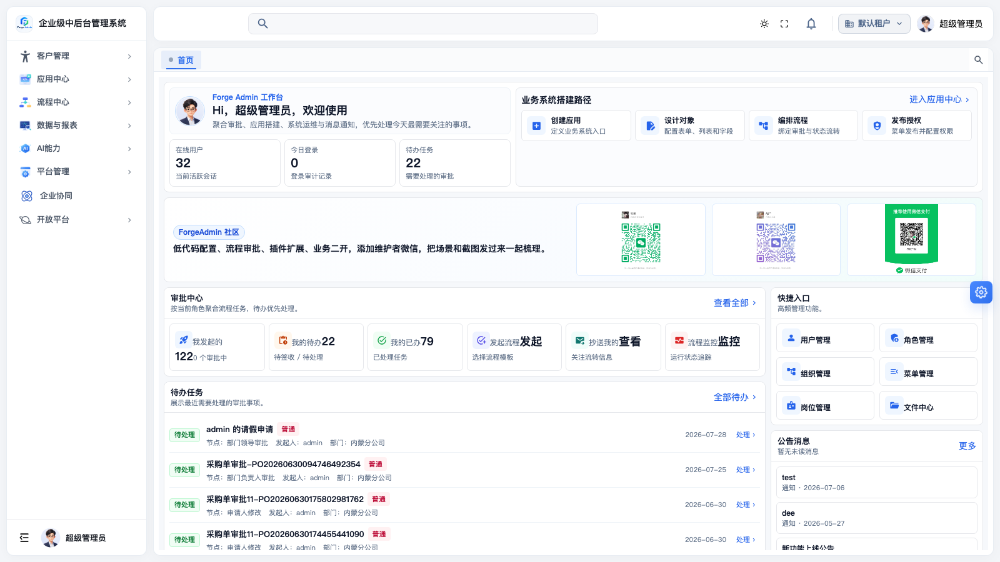
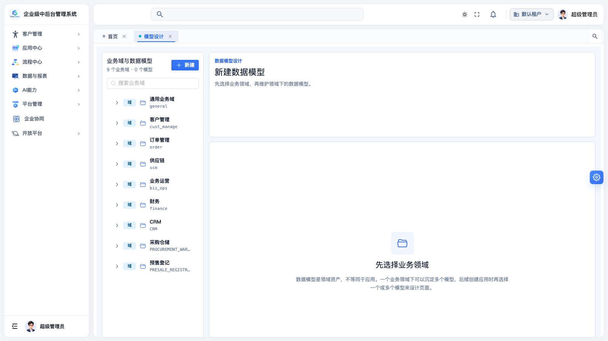
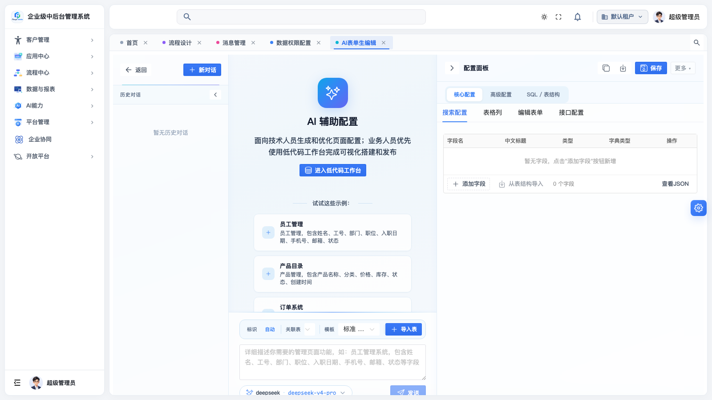
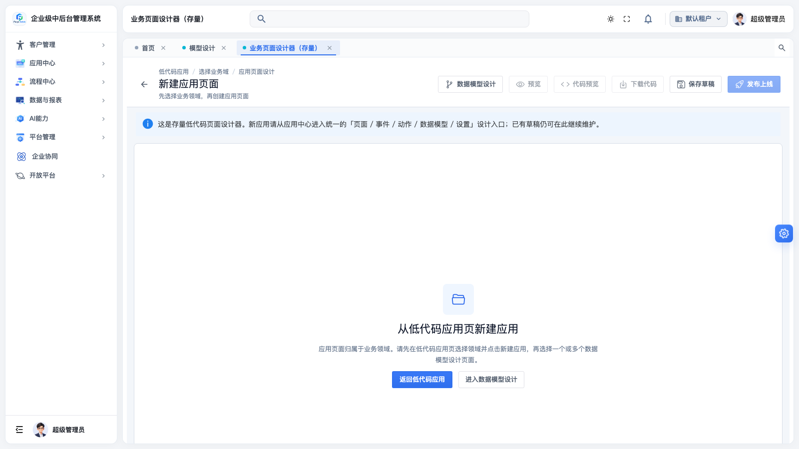
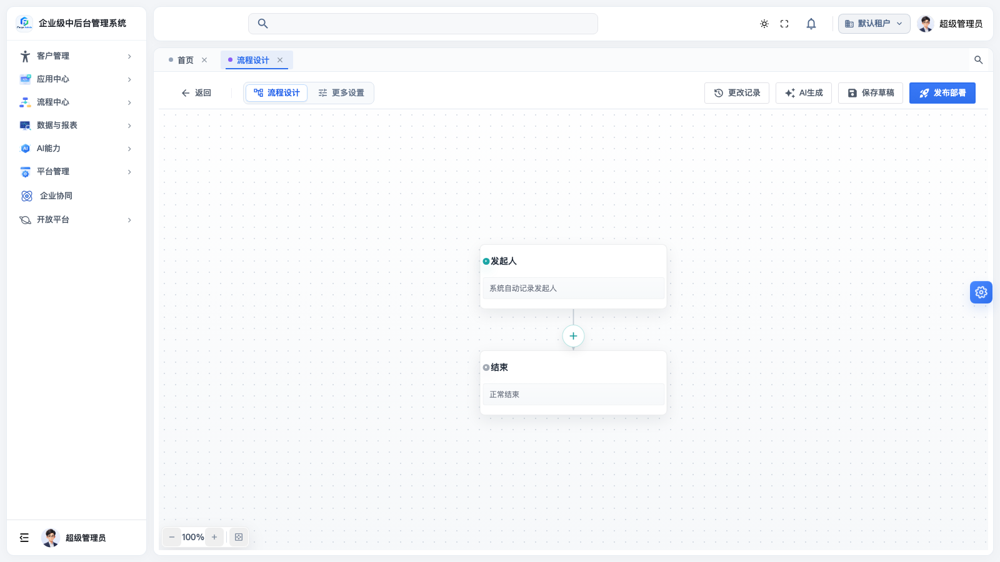
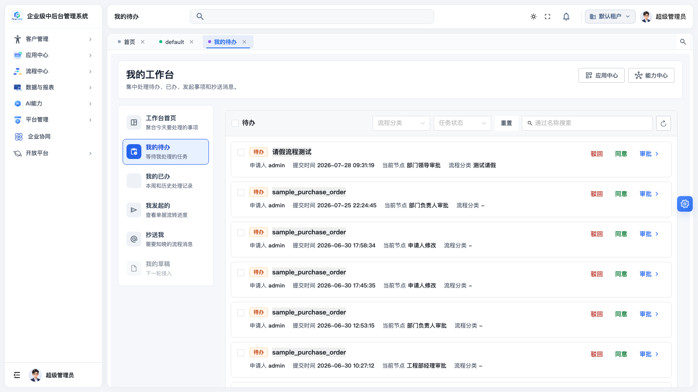
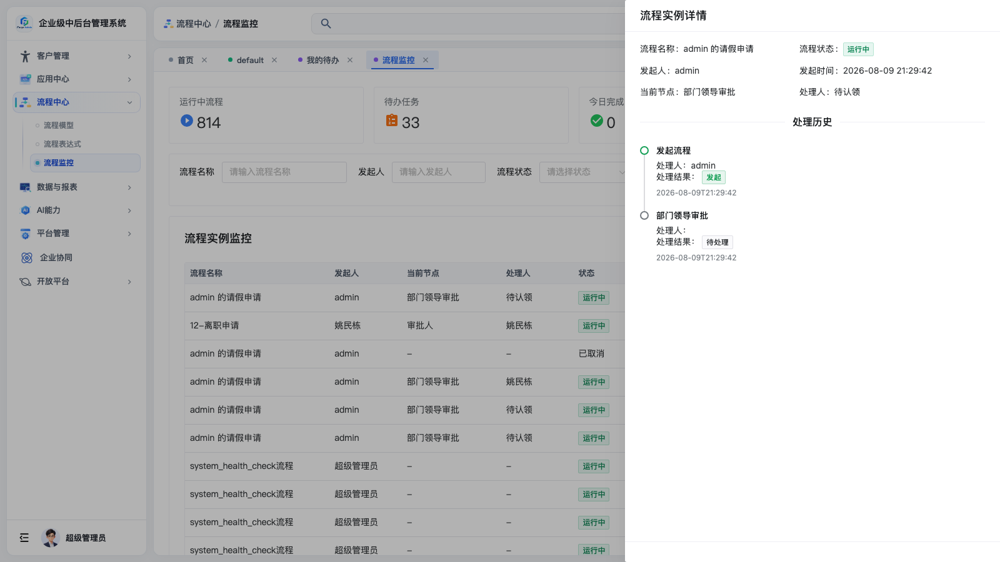
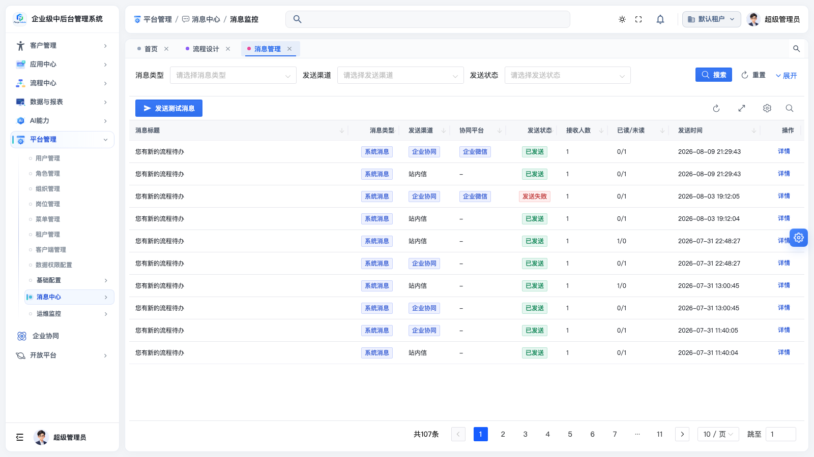
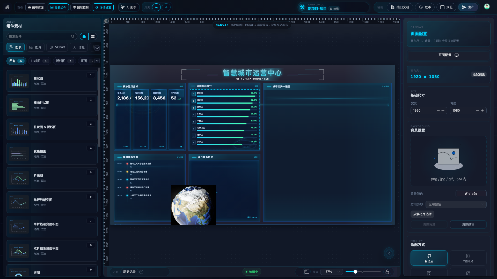
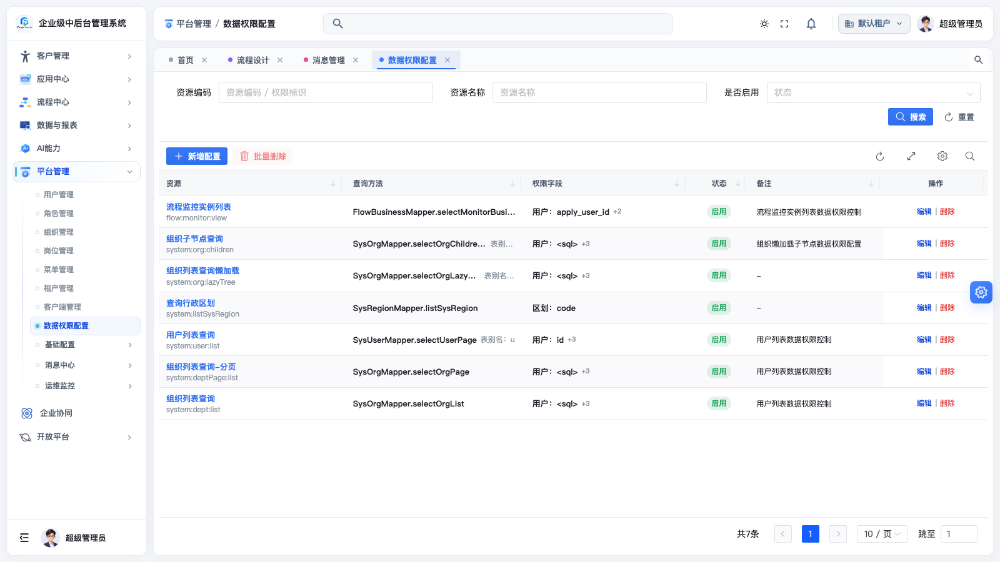

# 企业后台最缺的不是功能,是"闭环"——这套开源框架把六件事一次做完了

> 做了多年企业后台,我发现一个扎心的真相:单看每个模块,市面上框架什么都有;但把它们串成一条"能跑通业务"的链路,绝大多数项目都要自己再折腾半年。

先看一个真实的场景:业务员在小程序里提交一张采购单 → 系统要自动建单 → 走审批流 → 部门经理在手机上批 → 批完通知财务 → 财务在数据大屏上看汇总 → 外部 ERP 还要能调这个单子的接口。

从**建单、审批、通知、移动端处理、数据呈现、对外开放**——这一整条链路,就是企业后台常说的"闭环"。

我开源的框架 **Forge Admin**,想解决的正是这件事:不做一个又一个孤立的功能,而是把六块能力织成一张完整的网。今天就把这六块拆开讲透。

> 所有功能都能在线体验:http://www.dlforgelab.com:8084/forge/login (账号 `admin` / `123456`)


*▲ 工作台首页:系统状态、业务指标、待办入口集中呈现*

---

## 一、低代码:配置即业务,10 分钟跑起一个模块

先说低代码。很多框架的低代码是"生成一坨代码"——在线配表单,一键生成前后端代码,你手工 Merge 进项目。问题随之而来:**改完再生成就要处理代码冲突,页面和代码死死绑在一起**,改一个字段要动 Entity、DTO、VO、Mapper、Vue 五六个文件。

Forge 走的是另一条路:**协议驱动**。核心是一套 JSON Schema 协议:

- `modelSchema` 定义数据模型(字段、类型、约束)
- `pageSchema` 定义页面编排(表格列、搜索项、表单、按钮、接口)

低代码的最终产物**不是代码,是一份 JSON 协议**,页面由运行时引擎按协议动态渲染。

> 改配置,页面直接变。页面和代码彻底解耦,不存在"改了再生成要合并冲突"。

第一步,浏览器里可视化设计数据模型,不碰 SQL:


*▲ ModelDesigner:拖字段、定类型、设约束,可视化设计数据模型*

第二步,一句话描述需求,AI 生成表单结构,生成后还能拖拽微调:


*▲ 自然语言 → AI 生成表单结构*

第三步,低代码应用直接搭建运行:


*▲ 模型 + 页面协议驱动,配置即业务*

一个带搜索、分页、表单、增删改查的标准 CRUD 页面,过去要写两天,现在配一份 api-config + schema,**10 分钟就能跑起来**。

复杂业务也有退路:AI 生成配置 JSON → 模板渲染成规范代码包 → 下载二次开发。简单业务 0 代码上线,复杂业务随时接棒,不把开发者堵死在配置里。

---

## 二、流程:从发起到追溯,审批的完整闭环

很多框架的"工作流"是 Demo 级——给你一个请假例子,真到接业务,发现审批人怎么动态算、流程怎么和业务数据绑定、记录怎么追溯,全是坑。

Forge 直接集成 **Flowable 7.0**(BPMN 2.0 标准引擎),把审批做成了完整闭环:

| 环节 | Forge 提供什么 |
|------|----------------|
| 流程设计 | 在线 BPMN 设计器 + 钉钉风格审批流设计器,双模式 |
| 流程发起 | `@FlowStart` 注解,业务代码一行发起流程 |
| 待办审批 | 我的待办、通过/驳回/转办,移动端也能批 |
| 审批人计算 | SpEL 表达式动态计算(按部门负责人、按金额分级等) |
| 流程追溯 | 流程时间轴,谁在什么时候做了什么一目了然 |
| 业务绑定 | `@FlowBind` / `@FlowCallback`,流程结果自动回调业务 |


*▲ 在线流程设计器:拖拽画流程,业务人员也能看懂*

最实用的是**审批人动态计算**:"金额 > 1 万走总监审批,否则部门主管即可"这种规则,不用写死在代码里,SpEL 表达式配置即可。


*▲ 待办中心:通过/驳回/转办,一站式处理*


*▲ 流程时间轴:谁、什么时候、做了什么,全程可追溯*

请假、采购、合同、报销、工单——需要流程编排的业务,接进来基本是配置 + 少量回调代码的事。

---

## 三、企业协同:人走到哪,业务跟到哪

功能再全,如果员工还要打开电脑才能办公,这个系统就是"半残"的。Forge 的企业协同做了两层:

### 3.1 移动端:审批、待办、消息手机上闭环

基于 **uni-app + Vue3** 的独立 H5,一套代码同时发布 H5、微信小程序、支付宝小程序。首页工作台、消息中心、流程待办、个人中心,审批流程在手机上即可完成闭环。


*▲ 移动端 H5:PC 上的业务,手机上照样处理*

### 3.2 企业微信:不是"扫码登录",是整个协同层

很多人以为"企微集成"就是加个扫码登录。不是。

Forge 先做了一层**平台无关的企业协同 SPI**,企业微信只是第一个完整适配器——飞书、钉钉以后只需实现 Connector,不动组织同步、消息、待办和运维主链路。

| 能力 | 说明 |
|------|------|
| 通讯录同步 | 全量 + 增量 + 冲突处理 + 问题单,"企微是通讯录权威,Forge 是权限权威" |
| 安全登录 | 服务端 state 校验 + 短期 socialTicket,前端拿不到第三方用户信息 |
| 消息投递 | 站内信、系统通知、审批提醒统一消息中心投递 |
| 待办投影 | Flowable 任务 → 企微卡片,状态始终以 Forge 为准,点击卡片重新校验权限 |

**安全上下过狠功夫**:所有 Secret 走版本化 AES-GCM 认证加密存储,管理端只返回"已配置"状态;待办卡片点击后重新校验外部身份 → 接收人 → 租户 → 任务状态 → 办理权限,任务已完成或无权操作时不重复执行。


*▲ 消息中心:站内信、系统通知、消息模板统一管理*

---

## 四、开放能力平台:把内部能力安全地"开出去"

企业里不可能只用一套系统。外部 ERP、小程序、第三方应用要调你的业务接口——这是"开放能力平台"要解决的:不是给对接方一套账号密码,而是用一套**统一 REST 开放网关**兜住所有外部调用。

外部请求进来,走一条十步链路:

```
认证(OAuth Bearer 或 HMAC-SHA256 签名)
→ 防重放(timestamp ±5分钟 + nonce 一次性校验)
→ 授权(能力是否已发布?客户端是否已授权?)
→ 身份校验(USER / SERVICE / BOTH)
→ 限流(读 120次/分,写 20次/分,可配置)
→ 幂等(写操作强制 Idempotency-Key,命中返回首次响应快照)
→ Schema 校验(按已发布版本校验请求体)
→ 执行(能力执行器 + 执行身份上下文)
→ 统一响应 → 审计入库
```

**这条链路上每一步都是可配置、可审计、可拒绝的**,任何一步不通过直接返回明确错误码。

更关键的是**能力注册的三重管控**——不是什么接口都能开放:

| 能力来源 | 说明 | 安全控制 |
|---------|------|---------|
| 业务动作 | 低代码业务对象的增删改查 | 按字段白名单过滤 |
| 流程动作 | 发起流程、提交申请、审批 | 强制 USER 委托身份 |
| 系统服务 | 代码显式注册的服务 | 管理端不可填任意 URL,只选注册项 |

系统服务是防止"把内部接口直接代理出去"的关键设计——管理员不能在后台上传一个 URL 就开放接口,调用者也不能指定 modelKey、tenantId、userId,避免越权。

配套的还有:四步式调用指南(管理员配完自己就知道能不能调、怎么调)、Markdown 调用文档 + OpenAPI 3.1 JSON(可直接导入 Swagger/Apifox)、每次调用(含被拒绝的)审计入库、`requestId` 串联全链路排障。

> 一句话:内部用户走企业协同,外部系统走能力开放,两套链路各自安全,拼在一起就是完整的企业集成故事。

---

## 五、闭环能力:一条业务,从想法到上线到治理

前四块拆开看是功能,拼在一起才是 Forge 真正的底气——**业务闭环**。拿"采购审批"走一遍全流程:

1. **建模型**:浏览器里画出采购单数据模型(低代码)
2. **出页面**:AI 生成配置,10 分钟跑起 CRUD 页面(低代码)
3. **接流程**:表单提交触发 Flowable 流程,`@FlowCallback` 把审批结果回写业务(流程)
4. **推消息**:待办任务投影成企微卡片 + 站内信通知,手机上直接批(企业协同)
5. **看数据**:审批通过的数据进大屏,AI 生成可视化看板接真实 API(数据呈现)
6. **开接口**:外部 ERP 通过开放网关调单子接口,全程限流幂等审计(开放平台)


*▲ AI 大屏:自然语言生成草稿,拖拽编辑,接真实业务 API,一键发布*

从**定义业务**到**运行业务**再到**治理业务**,一条链路全部打通——这,才是"闭环"的真正含义。你不需要在五个系统之间来回搬数据。

---

## 六、底层框架能力:地基决定上层建筑

前五块是"楼",地基才是企业级系统能不能长期演进的关键。Forge 的架构是**微内核 + 插件化**:

```
forge-framework/
├── forge-starter-parent/    # 技术能力 Starter(auth/tenant/orm/crypto/excel/file 等 20 个)
├── forge-plugin-parent/     # 业务能力 Plugin(system/generator/flow/message/ai/job)
└── 应用服务                 # 按场景聚合插件,对外提供接口
```

技术能力沉到 Starter,业务能力做成 Plugin,引入即生效、按需组合,长期二开不会越写越乱。几个硬核地基:

- **多租户**:SQL 层自动注入 + 五级忽略策略,引第三方表没有 tenant_id 字段?自动跳过不报错。做 SaaS 不用改每个 Mapper
- **数据权限**:7 种数据范围(全部/本人/本组织/组织及子组织/自定义/租户全部/行政区划),在 Mapper 层直接改写 SQL 的 WHERE 子句——无论怎么写 SQL,权限都绕不过去
- **接口安全**:RSA 密钥协商 + SM4/AES 会话加密,敏感接口传输全程加密;nonce 防重放;分布式幂等三套策略(STRICT / RETURN_CACHE / TOKEN_REQUIRED)
- **运维治理**:操作日志、定时任务、服务监控、缓存管理、文件存储、Excel 导入导出模板配置,上线后全部开箱即用


*▲ 数据权限:按组织、角色、业务规则配置数据范围,降低越权风险*


*▲ 微内核 + 插件化:Starter 管技术能力,Plugin 管业务能力*

---

## 写在最后

这套框架不是又一个"后台管理脚手架"。它想表达的是:**企业后台的竞争力,不在某一个功能多强,而在业务能不能闭环、能力能不能开放、地基能不能支撑长期演进。**

**技术栈**:Java 17 + Spring Boot 3 + MyBatis-Plus + Sa-Token + Flowable 7.0 | Vue 3 + Naive UI + Vite + Pinia | uni-app(多端)

**适合谁用**:

| 场景 | 为什么选 Forge |
|------|----------------|
| SaaS 多租户后台 | 多租户 + 数据权限深度集成 |
| OA / 采购 / 合同 / 工单审批 | Flowable 全闭环 |
| 数据大屏 / 驾驶舱 | AI 生成 + 真实数据接入 |
| 快速交付业务页面 | 协议驱动低代码 + AI 配置 |
| 对接企微/外部系统 | 企业协同 + 开放能力平台 |

**上手很简单**:克隆 → 一键初始化数据库脚本 → 改下数据库配置 → 后端 `mvn spring-boot:run`、前端 `pnpm dev`,默认 `admin` / `123456` 登录。

**演示地址**:
- 后台管理:http://www.dlforgelab.com:8084/forge/login
- AI 大屏:http://www.dlforgelab.com:8084/forge-report/
- 移动端 H5:http://www.dlforgelab.com:8084/forge-h5/ (账号 `h5_admin` / `123456`)

**源码**:Gitee https://gitee.com/ForgeLab/forge-admin ｜ GitHub https://github.com/yaomindong1996/forge-admin

> 开源不易,持续迭代更难。如果这个项目对你有用,点个 Star 是对作者最大的鼓励 ⭐
>
> 你做企业后台最头疼的是哪一环?低代码、审批流、企微协同还是对外开放接口?评论区聊聊,我会挨个回复。
